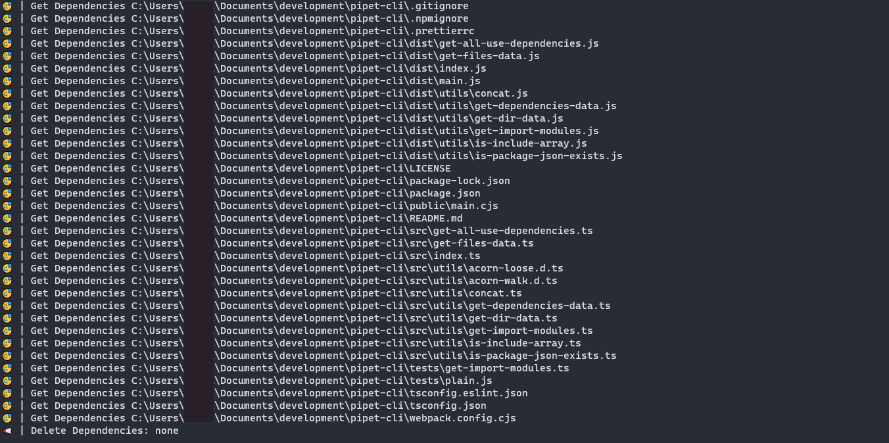
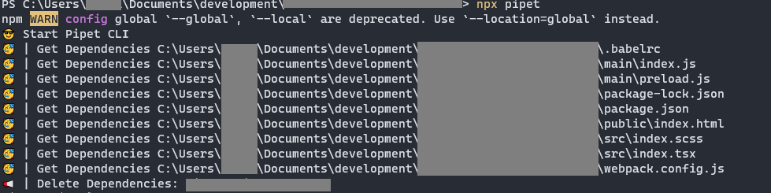

<h2 align="center">pipet-cli</h2>
<h3 align="center">Remove unnecessary dependencies</h5>
<div align="center">


[](https://actions-badge.atrox.dev/chocolate-pie/pipet-cli/goto?ref=master)

</div>


## Whats This?
Remove unnecessary dependencies to speed up ```npm install```

🎊 automatically delete DefinitelyTyped Dependencies.

😎 Just type ```pipet``` in the command line. Easy.
### Support Import Syntax (dependencies)
| Import Syntax | Support Version |
| ------- | ----- |
| ``` const example = import('example')``` | 2.1.0 | 
| ``` const example = require('example')``` | 2.1.0 |
| ``` const example = require.resolve('example')``` | 2.1.0 |
| ``` import example from 'example' ``` | 2.1.0 |
| ``` const example = import('example/example')``` | 2.2.0 | 
| ``` const example = require('example/example')``` | 2.2.0 |
| ``` const example = require.resolve('example/example')``` | 2.2.0 |
| ``` import example from 'example/example' ``` | 2.2.0 |


### Install
```sh
npm install -g pipet-cli
```
### How To Use

```
pipet
```
If you have installed locally,
```
npx pipet
```
#### Options
```--ext``` Specifies the extension of the target file. By doing this, files such as images can be removed, which speeds up the process.　However, do this and ensure that necessary dependencies are not removed.

Example: 
```sh
npx pipet --ext .js,.ts
```
```--uninstaller``` Specifies the uninstaller to be used internally. ```npm``` or ```yarn``` default: ```npm```

Example:
```sh
npx pipet --uninstaller npm
```
```--ignore-file-path``` Specifies the path of the dependency configuration file to ignore. Dependencies to be ignored will not be deleted, even if they are targeted for deletion. default: ```./.pipetignore```

Example:
```sh
npx pipet --ignore-file-path ./.pipetignore
```
### How to write Ignore file  
Default Ignore File Name: ```.pipetignore```

Write with line breaks.

Example:
```txt
exampleDependencies01
exampleDependencies02
```

